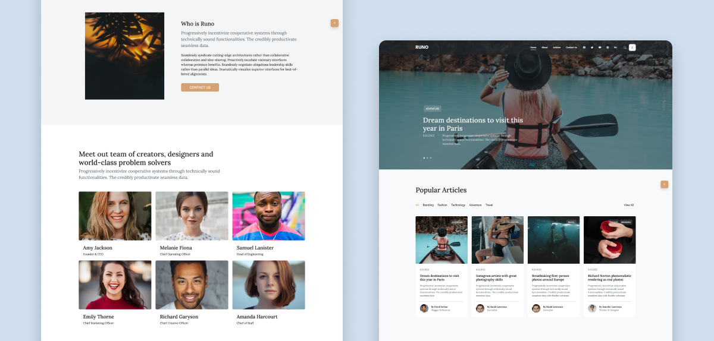

# Eezy Bank 

In this project you’ll build a simple Blogging Application with [Node](https://nodejs.org/docs/latest/api/), [Express](https://expressjs.com/) and [Mongoose](). This application has a login authentication system, user sessions and CRUD operations to the a MongoDB database. 

## Table of contents

- [Overview](#overview)
  - [Screenshot](#screenshot)
  - [Links](#links)
- [Tech Stack](#tech-stack)
- [Author](#author)

## Overview

### Screenshot

### Links

- Code URL: [Github Repo.](https://github.com/mzwabantu/runo)
- Live Site URL: [Runo](http://runo.mzwwwa.co.za/)

## Tech stack

- NodeJS
- ExpressJS
- EJS
- Javascript
- HTML5
- CSS 
- Bootstrap 5
- Mongoose

## Author

- Website - [Mzwabantu](https://mzwwwa.co.za/)
- LinkedIn - [mzwabantungubelanga](https://za.linkedin.com/in/mzwabantungubelanga)
- Dribbble - [MzwaN](https://dribbble.com/MzwaN)